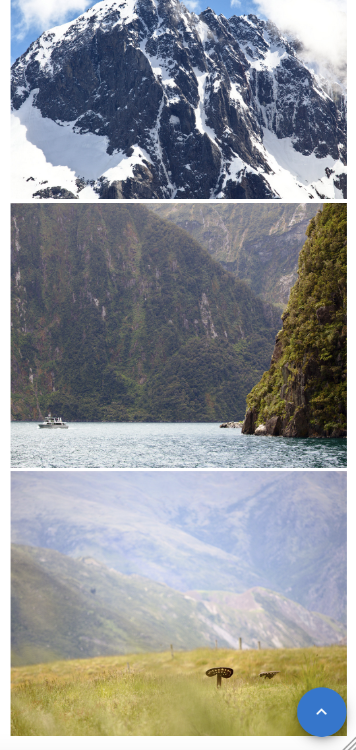

# photo-gallery

A really simple TypeScript based photo gallery for React apps.

# How to use

## Install it

Yarn

`yarn add @alexaritan/photo-gallery`

or npm

`npm i @alexaritan/photo-gallery`

## Use it

```
import { PhotoGrid } from '@alexaritan/photo-gallery;

export const Gallery = () => {
	const photoUrls = ['./img1.jpg', './img2/jpg'];
	const onClick = (id) => console.log(`clicked image ${id}`);
	const subtitle = 'Sweet, sweet chocolate';
	const title = 'I remember when they first invested chocolate';

	return (<PhotoGrid
		imgUrls={photoUrls}
		onClick={onClick}
		subtitle={subtitle}
		title={title}
	/>);
};
```

## Screenshots

Default display on desktop


Automatically reformats for mobile


Includes a "back to top" button after scrolling down a bit


