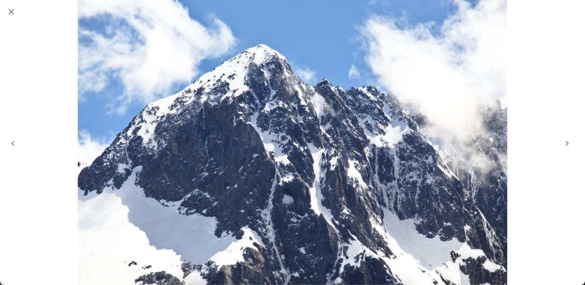

# photo-gallery

A really simple TypeScript based photo gallery for React apps. Built using MUI.

# Features

- Displays a grid of photos by providing a list of URLs
- Formats appropriately for desktop and mobile
- Displays a single full page photo with
  - close, back, and next icons (on desktop)\*
  - arrow key navigation (on desktop)\*
  - swipe left/right to navigate, down the close (on mobile)\*

\* You'll need to provide the `handleClose`, `handleNext`, and `handlePrevious` functions for swipe, arrow key, and ui-based navigation on full page photos. I didn't want to closely couple this library with any specific implementation. One potential solution is using `react-router-dom`.

# How to use

## Install it

Yarn

`yarn add @alexaritan/photo-gallery`

or npm

`npm i @alexaritan/photo-gallery`

## Use it

Display a gallery

```
import { PhotoGrid } from '@alexaritan/photo-gallery;

export const Gallery = () => {
	const photoUrls = ['./img1.jpg', './img2/jpg'];
	const onClick = (id) => console.log(`clicked image ${id}`);
	const subtitle = 'Sweet, sweet chocolate';
	const title = 'I remember when they first invested chocolate';

	return (
		<PhotoGrid
			imgUrls={photoUrls}
			onClick={onClick}
			subtitle={subtitle}
			title={title}
		/>
	);
};
```

View a single photo

```
import { FullPagePhoto } from '@alexaritan/photo-gallery';

export const Photo = () => {
	//Handlers for what to do when the user closes the image and for navigating between images.
	const handleClose = () => console.log('closed');
	const handleNext = () => console.log('next');
	const handlePrevious = () => console.log('previous');
	const src = './img1.jpg';

	return (
		<FullPagePhoto
			fullScreen={true}
			handleClose={handleClose}
			handleNext={handleNext}
			handlePrevious={handlePrevious}
			src={src}
		/>
	);
};
```

## Gallery Screenshots

Default desktop display


Automatically reformats for mobile


Includes a "back to top" button after scrolling down a bit


## Full page photo screenshot

Default desktop display includes a close button and next/previous buttons on desktop



Mobile display of a single photo doesn't include icons and supports swiping left/right between photos and down to close


